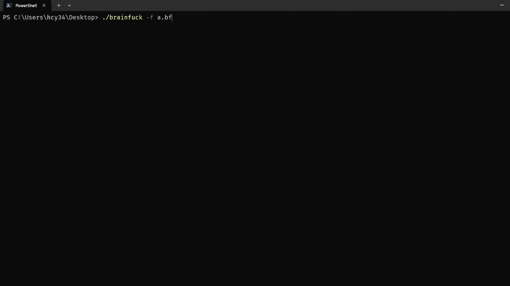
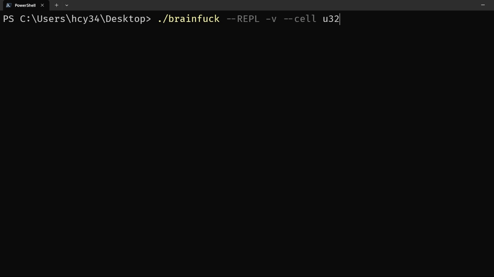
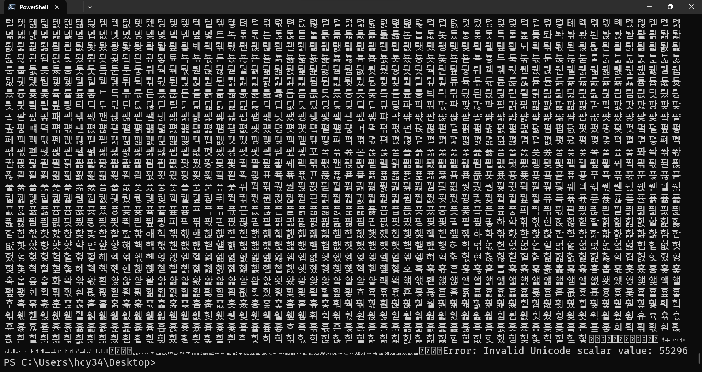

# brainfuck

My first `Rust` project : `brainfuck interpreter`，`comprehensive` and
`easy to read`

## Usage

```
$ ./brainfuck --help
Usage:

[code]               Use an argument as the code
-f [path]            Read code from a file
--REPL | --repl      Start in REPL mode
--bulk               Bulk output mode
--cell [u8|u16|u32]  Set the cell size
-v | --verbose       Display verbose information
--IR                 Display intermediate representation of the code
[input]              Input can be a string ending with 'u32' to be parsed as uint32
```

## Show






