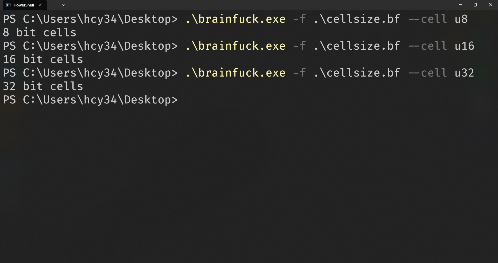

# brainfuck

My first `Rust` project : `brainfuck interpreter`，`comprehensive` and
`easy to read`

## Usage

```
$ ./brainfuck --help
Usage:

[code]               Use an argument as the code
-f [path]            Read code from a file
--REPL | --repl      Start in REPL mode
--bulk               Bulk output mode
--cell [u8|u16|u32]  Set the cell size
-v | --verbose       Display verbose information
--IR                 Display intermediate representation of the code
[input]              Input can be a string ending with 'u32' to be parsed as uint32
```

## Show





## Commands of BF language

The language consists of eight commands. A brainfuck program is a sequence of
these commands:

| Character | Meaning                                                                                                                                                                             |
| --------- | ----------------------------------------------------------------------------------------------------------------------------------------------------------------------------------- |
| `>`       | Increment the data pointer by one (to point to the next cell to the right).                                                                                                         |
| `<`       | Decrement the data pointer by one (to point to the next cell to the left).                                                                                                          |
| `+`       | Increment the byte at the data pointer by one.                                                                                                                                      |
| `-`       | Decrement the byte at the data pointer by one.                                                                                                                                      |
| `.`       | Output the byte at the data pointer.                                                                                                                                                |
| `,`       | Accept one byte of input, storing its value in the byte at the data pointer.                                                                                                        |
| `[`       | If the byte at the data pointer is zero, then instead of moving the instruction pointer forward to the next command, jump it forward to the command after the matching `]` command. |
| `]`       | If the byte at the data pointer is nonzero, then instead of moving the instruction pointer forward to the next command, jump it back to the command after the matching `[` command  |
